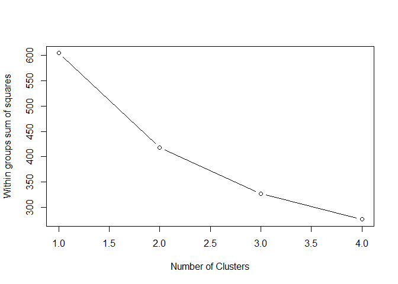
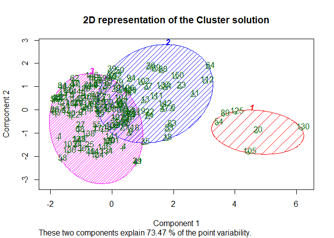
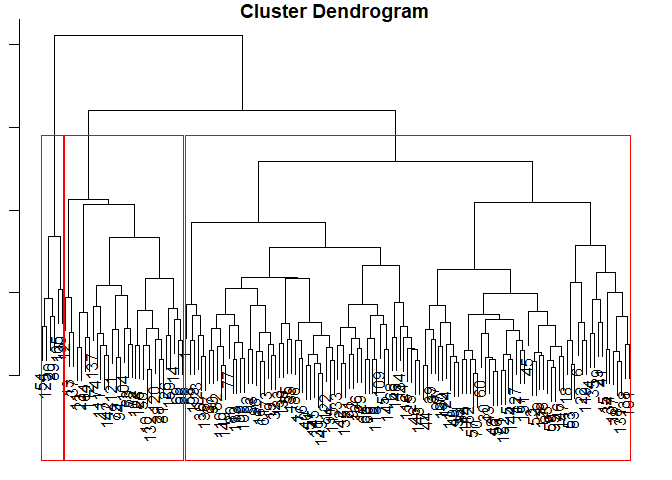

Clustering - Diabetic Data
================
Hitendra Parmar
December 10, 2018

``` r
knitr::opts_chunk$set(echo = TRUE)
########################### CLUSTERING ANALYSIS ###########################

diabetes <- read.csv("diabetic_data.csv", header = TRUE, stringsAsFactors = FALSE) # File available in zip
diab_stand <- scale(diabetes[-c(1:5)])

k.means.fit <- kmeans(diab_stand, 3) # k-means = 3

k.means.fit$centers # Centroid
```

    ##   time_in_hospital num_lab_procedures num_procedures num_medications
    ## 1        1.8529795          1.3327812     2.32692071       3.0478182
    ## 2        0.8367453          0.4382492     0.03361919       0.4531570
    ## 3       -0.5811557         -0.3275069    -0.16712470      -0.4452242

``` r
k.means.fit$cluster # Clusters
```

    ##   [1] 3 3 3 3 3 2 3 2 3 2 2 2 2 2 3 3 3 2 2 1 3 2 2 3 3 2 3 2 3 3 3 3 2 3 2
    ##  [36] 3 2 3 2 3 3 2 3 3 3 3 2 3 3 2 3 3 2 1 3 3 3 3 3 3 3 3 3 2 2 2 3 3 2 3
    ##  [71] 2 2 3 2 3 3 3 3 2 3 2 3 2 3 3 3 3 2 1 3 3 3 3 2 3 3 3 3 3 3 3 2 3 2 1
    ## [106] 2 3 3 3 3 2 2 3 3 3 3 2 2 2 2 2 3 3 2 1 2 3 3 2 1 2 2 3 3 2 3 2 3 3 3
    ## [141] 3 2 3 3 3 3 3 3 3 2 3 3

``` r
wssplot <- function(diabetes, nc=15, seed=1234){
  wss <- (nrow(diabetes)-1)*sum(apply(diabetes,2,var))
  for (i in 2:nc){
    set.seed(seed)
    wss[i] <- sum(kmeans(diabetes, centers=i)$withinss)}
  plot(1:nc, wss, type="b", xlab="Number of Clusters",
       ylab="Within groups sum of squares")}

wssplot(diab_stand, nc=4) 
```



``` r
library(cluster)
```

    ## Warning: package 'cluster' was built under R version 3.5.1

``` r
clusplot(diab_stand, k.means.fit$cluster, main='2D representation of the Cluster solution',
         color=TRUE, shade=TRUE,
         labels=2, lines=0)
```



``` r
#Cusplot shows that the cluster 1, which is somewhat separated due to containing all extreme outliers was given a
#cluter of its own. This shows that choosing clusters greater than 3 would not have been a good decision; as the
# dataset only contains 152.

table(diabetes[,4],k.means.fit$cluster)
```

    ##            
    ##              1  2  3
    ##   [0-25)     0  4  3
    ##   [100-125)  2  5 22
    ##   [125-150)  0  4  3
    ##   [150-175)  0  0  1
    ##   [175-200)  0  1  0
    ##   [25-50)    0  1  4
    ##   [50-75)    0 15 30
    ##   [75-100)   4 22 30
    ##   >200       0  0  1

``` r
# This table shows that fat people (100 kgs+), who have diabetes are represented in the cluster 1. Cluster 2 contains
# people who are not overweight but still have diabetes, indicating they might have become diabetic genetically.

# Making dendograms
dend <- dist(diab_stand, method = "euclidean")
dend_fit <- hclust(dend, method="complete")
#library(dplyr)
par(mar=c(1,1,1,1))
plot.new() ; plot(dend_fit) # It looks like 3 clusters chosen earlier seem reasonable.

groups <- cutree(dend_fit, k=3) 
rect.hclust(dend_fit, k=3, border="red")
```



``` r
library(dplyr)
```

    ## Warning: package 'dplyr' was built under R version 3.5.1

    ## 
    ## Attaching package: 'dplyr'

    ## The following objects are masked from 'package:stats':
    ## 
    ##     filter, lag

    ## The following objects are masked from 'package:base':
    ## 
    ##     intersect, setdiff, setequal, union

``` r
diabetes_clus <- data.frame(diabetes[,4], diab_stand, clusters=groups) 

summary(diabetes_clus[which(diabetes_clus$clusters==1), ])
```

    ##    diabetes...4. time_in_hospital  num_lab_procedures num_procedures     
    ##  [75-100) :41    Min.   :-1.1620   Min.   :-2.9729    Min.   :-0.821974  
    ##  [50-75)  :38    1st Qu.:-0.8331   1st Qu.:-0.7570    1st Qu.:-0.821974  
    ##  [100-125):23    Median :-0.5042   Median :-0.1084    Median :-0.212510  
    ##  [125-150): 5    Mean   :-0.4212   Mean   :-0.2029    Mean   : 0.004777  
    ##  [25-50)  : 4    3rd Qu.:-0.1753   3rd Qu.: 0.4590    3rd Qu.: 0.396953  
    ##  [0-25)   : 3    Max.   : 0.8114   Max.   : 1.6751    Max.   : 2.834807  
    ##  (Other)  : 1                                                            
    ##  num_medications      clusters
    ##  Min.   :-1.6188   Min.   :1  
    ##  1st Qu.:-0.8348   1st Qu.:1  
    ##  Median :-0.2748   Median :1  
    ##  Mean   :-0.3235   Mean   :1  
    ##  3rd Qu.: 0.1732   3rd Qu.:1  
    ##  Max.   : 1.2932   Max.   :1  
    ## 

``` r
summary(diabetes_clus[which(diabetes_clus$clusters==2), ])
```

    ##    diabetes...4. time_in_hospital  num_lab_procedures num_procedures   
    ##  [75-100) :11    Min.   :-0.5042   Min.   :-2.16220   Min.   :-0.8220  
    ##  [50-75)  : 7    1st Qu.: 0.6470   1st Qu.:-0.02738   1st Qu.:-0.8220  
    ##  [0-25)   : 4    Median : 1.1404   Median : 0.59415   Median :-0.8220  
    ##  [100-125): 4    Mean   : 1.2040   Mean   : 0.49478   Mean   :-0.4681  
    ##  [125-150): 2    3rd Qu.: 1.7982   3rd Qu.: 0.97247   3rd Qu.:-0.2125  
    ##  [150-175): 1    Max.   : 3.1138   Max.   : 1.99935   Max.   : 0.3970  
    ##  (Other)  : 2                                                          
    ##  num_medications      clusters
    ##  Min.   :-0.8348   Min.   :2  
    ##  1st Qu.: 0.1172   1st Qu.:2  
    ##  Median : 0.6212   Median :2  
    ##  Mean   : 0.6103   Mean   :2  
    ##  3rd Qu.: 1.2372   3rd Qu.:2  
    ##  Max.   : 1.7412   Max.   :2  
    ## 

``` r
summary(diabetes_clus[which(diabetes_clus$clusters==3), ])
```

    ##    diabetes...4. time_in_hospital num_lab_procedures num_procedures 
    ##  [75-100) :4     Min.   :0.8114   Min.   :0.8644     Min.   :1.616  
    ##  [100-125):2     1st Qu.:1.3048   1st Qu.:0.9725     1st Qu.:1.768  
    ##  [0-25)   :0     Median :1.9626   Median :1.2968     Median :2.530  
    ##  [125-150):0     Mean   :1.8530   Mean   :1.3328     Mean   :2.327  
    ##  [150-175):0     3rd Qu.:2.3737   3rd Qu.:1.6210     3rd Qu.:2.835  
    ##  [175-200):0     Max.   :2.7849   Max.   :1.9453     Max.   :2.835  
    ##  (Other)  :0                                                        
    ##  num_medications    clusters
    ##  Min.   :1.517   Min.   :3  
    ##  1st Qu.:2.413   1st Qu.:3  
    ##  Median :2.917   Median :3  
    ##  Mean   :3.048   Mean   :3  
    ##  3rd Qu.:3.757   3rd Qu.:3  
    ##  Max.   :4.653   Max.   :3  
    ## 

``` r
summary(diabetes_clus[which(diabetes_clus$clusters==4), ])
```

    ##    diabetes...4. time_in_hospital num_lab_procedures num_procedures
    ##  [0-25)   :0     Min.   : NA      Min.   : NA        Min.   : NA   
    ##  [100-125):0     1st Qu.: NA      1st Qu.: NA        1st Qu.: NA   
    ##  [125-150):0     Median : NA      Median : NA        Median : NA   
    ##  [150-175):0     Mean   :NaN      Mean   :NaN        Mean   :NaN   
    ##  [175-200):0     3rd Qu.: NA      3rd Qu.: NA        3rd Qu.: NA   
    ##  [25-50)  :0     Max.   : NA      Max.   : NA        Max.   : NA   
    ##  (Other)  :0                                                       
    ##  num_medications    clusters  
    ##  Min.   : NA     Min.   : NA  
    ##  1st Qu.: NA     1st Qu.: NA  
    ##  Median : NA     Median : NA  
    ##  Mean   :NaN     Mean   :NaN  
    ##  3rd Qu.: NA     3rd Qu.: NA  
    ##  Max.   : NA     Max.   : NA  
    ## 

``` r
summary(diabetes_clus[which(diabetes_clus$clusters==5), ])
```

    ##    diabetes...4. time_in_hospital num_lab_procedures num_procedures
    ##  [0-25)   :0     Min.   : NA      Min.   : NA        Min.   : NA   
    ##  [100-125):0     1st Qu.: NA      1st Qu.: NA        1st Qu.: NA   
    ##  [125-150):0     Median : NA      Median : NA        Median : NA   
    ##  [150-175):0     Mean   :NaN      Mean   :NaN        Mean   :NaN   
    ##  [175-200):0     3rd Qu.: NA      3rd Qu.: NA        3rd Qu.: NA   
    ##  [25-50)  :0     Max.   : NA      Max.   : NA        Max.   : NA   
    ##  (Other)  :0                                                       
    ##  num_medications    clusters  
    ##  Min.   : NA     Min.   : NA  
    ##  1st Qu.: NA     1st Qu.: NA  
    ##  Median : NA     Median : NA  
    ##  Mean   :NaN     Mean   :NaN  
    ##  3rd Qu.: NA     3rd Qu.: NA  
    ##  Max.   : NA     Max.   : NA  
    ## 

``` r
summary(diabetes_clus[which(diabetes_clus$clusters==6), ])
```

    ##    diabetes...4. time_in_hospital num_lab_procedures num_procedures
    ##  [0-25)   :0     Min.   : NA      Min.   : NA        Min.   : NA   
    ##  [100-125):0     1st Qu.: NA      1st Qu.: NA        1st Qu.: NA   
    ##  [125-150):0     Median : NA      Median : NA        Median : NA   
    ##  [150-175):0     Mean   :NaN      Mean   :NaN        Mean   :NaN   
    ##  [175-200):0     3rd Qu.: NA      3rd Qu.: NA        3rd Qu.: NA   
    ##  [25-50)  :0     Max.   : NA      Max.   : NA        Max.   : NA   
    ##  (Other)  :0                                                       
    ##  num_medications    clusters  
    ##  Min.   : NA     Min.   : NA  
    ##  1st Qu.: NA     1st Qu.: NA  
    ##  Median : NA     Median : NA  
    ##  Mean   :NaN     Mean   :NaN  
    ##  3rd Qu.: NA     3rd Qu.: NA  
    ##  Max.   : NA     Max.   : NA  
    ##
