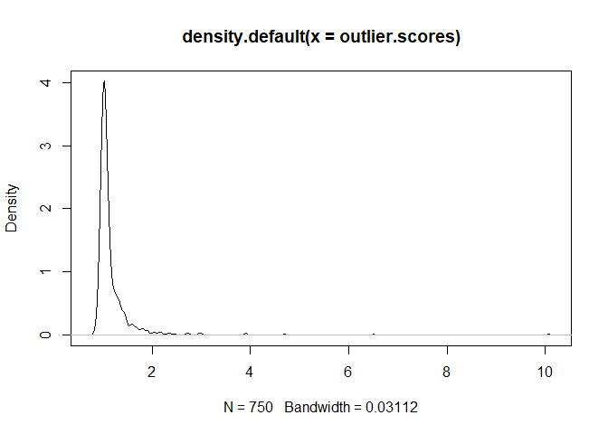
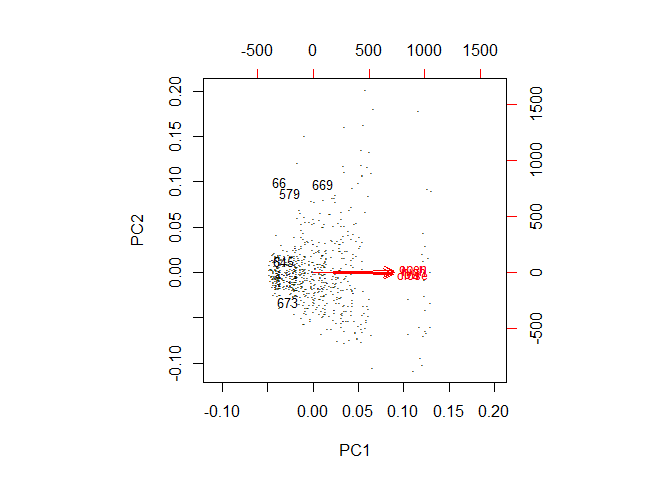
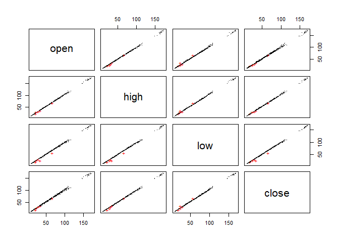

Outlier Detection
================
Hitendra Parmar
December 10, 2018

``` r
knitr::opts_chunk$set(echo = TRUE)
# Data Cleaning
dow_jones <- read.table("dow_jones_index.data", dec=",", sep = ",", header = TRUE, stringsAsFactors = FALSE)
stocks <- dow_jones[,4:7]
stocks$open <- as.numeric(gsub("\\$", "", stocks$open))
stocks$high <- as.numeric(gsub("\\$", "", stocks$high))
stocks$low <- as.numeric(gsub("\\$", "", stocks$low))
stocks$close <- as.numeric(gsub("\\$", "", stocks$close))

# Calculating Outlier Scores
library(DMwR)
```

    ## Warning: package 'DMwR' was built under R version 3.5.1

    ## Loading required package: lattice

    ## Loading required package: grid

``` r
outlier.scores <- lofactor(stocks, k=3)
plot(density(outlier.scores))
```



``` r
# Top 5 outliers
(outliers <- order(outlier.scores, decreasing=T)[1:5])
```

    ## [1] 579  66 645 673 669

``` r
n <- nrow(stocks)
labels <- 1:n
labels[-outliers] <- "."
biplot(prcomp(stocks), cex=.8, xlabs=labels)
```



``` r
pch <- rep(".", n)
pch[outliers] <- "+"
col <- rep("black", n)
col[outliers] <- "red"
pairs(stocks, pch=pch, col=col)
```



``` r
# We see that stock prices when they open, close are at their highest, and their lowest have heavy correlation between
# each other, with very few outliers present, indicated by a '+'.Dots in the biplot show normal distribution of stocks
# across both Princial Components.
```
