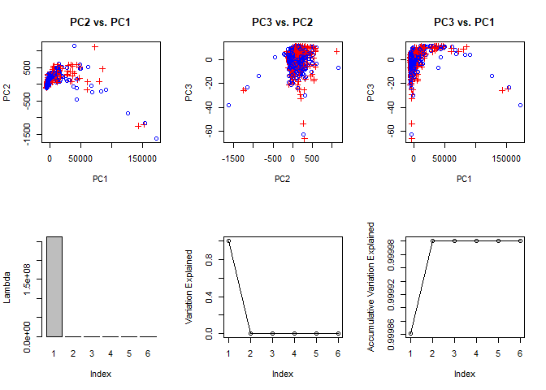

PCA - NASA
================
Hitendra Parmar
December 11, 2018

``` r
knitr::opts_chunk$set(echo = TRUE)

nasa_kc1 <- read.csv("kc1.csv")
nasa <- nasa_kc1[,c(6:10,12)]
colnames(nasa) <- c("volume","prog_length","difficulty","intelligence","effort","time")

# Go through each row and determine if a value is zero
row_sub <- apply(nasa, 1, function(row) all(row !=0))
nasa <- nasa[row_sub, ]
nasa <- nasa[sample(nrow(nasa), 1000), ] # Randomly selecting 1000 rows for PCA Analysis

# Calculating Outlier Scores
library(DMwR)
```

    ## Warning: package 'DMwR' was built under R version 3.5.1

    ## Loading required package: lattice

    ## Loading required package: grid

``` r
outlier.scores <- lofactor(nasa, k=3)

# Top 5 outliers
(outliers <- order(outlier.scores, decreasing=T)[1:100])
```

    ##   [1]   18   68   86   95  104  134  140  210  247  302  350  355  398  437
    ##  [15]  444  466  473  476  481  485  499  510  542  625  628  664  726  818
    ##  [29]  829  839  852  875  902  909  925 1000  880  190  250  393   20   29
    ##  [43]  979  265  945  893  580  531  794  949  258  418  179  239  678  575
    ##  [57]  304  650  929  547  955  490  516  309  260  182   97  305  519  804
    ##  [71]  787  922   26  729  765  952  623  130  227  900  367  559  923  965
    ##  [85]  126  283  308   72  484  866  993  856  449  679  342  772  457   32
    ##  [99]  722   39

``` r
nasa <- nasa[-c(outliers), ]

# Eigen values of the covariance matrix
eig <- eigen(cov(nasa)) # These eigen values explain how much variance there is in the data in the direction of eigen vectors.

# Projected data
proj_y <- (scale(nasa, center=T, scale=F)) %*% eig$vectors 
par(mfrow=c(2,3))
plot(proj_y[,1],proj_y[,2],pch=c(rep(1,100),rep(3,100)),
                 col=c(rep("blue",100),rep("red",100)),
                 main="PC2 vs. PC1",
                 xlab="PC1",ylab="PC2")
plot(proj_y[,2],proj_y[,3],pch=c(rep(1,100),rep(3,100)),
                 col=c(rep("blue",100),rep("red",100)),
                 main="PC3 vs. PC2",
                 xlab="PC2",ylab="PC3")
plot(proj_y[,1],proj_y[,3],pch=c(rep(1,100),rep(3,100)),
                 col=c(rep("blue",100),rep("red",100)),
                 main="PC3 vs. PC1",
                 xlab="PC1",ylab="PC3")

# Plotting the eigen vectors
barplot(eig$values,names.arg=1:6,xlab="Index",ylab="Lambda")
plot(eig$values/sum(eig$values),type="o",xlab="Index",ylab="Variation Explained")

acc.sums <- rep(NA,ncol(nasa))
for(i in 1:ncol(nasa)){
    acc.sums[i] <- sum(eig$values[1:i])
}
plot(acc.sums/sum(eig$values),type="o",xlab="Index",ylab="Accumulative Variation Explained")
```



``` r
# We can see from the variation plot that much of the variation was explained by the last plot. From the 3 Principal
# Component plots, we see that PC1 and PC2 seem to be somewhat separated but PC3 seems to be clustered across both PC1
# and PC2. This shows that PC3 does not seem to be of much use.
```
